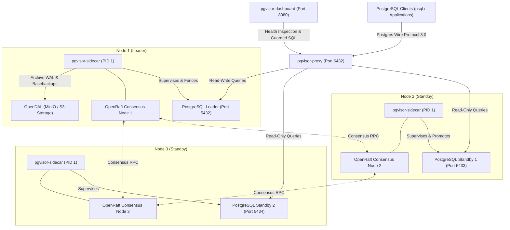
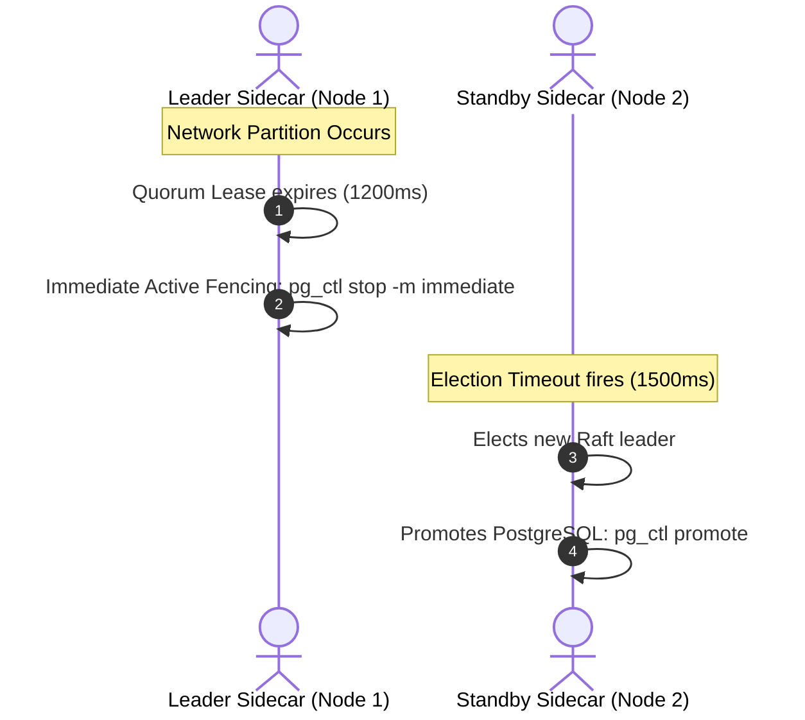

# PgVisor Architecture & Specification

## 1. System Overview

**PgVisor** is a lightweight, simplified PostgreSQL High Availability (HA) cluster supervisor, L7 wire protocol proxy, and cloud backup pipeline built entirely in pure Rust. It replaces the operational sprawl of Patroni, PgBouncer, Consul/Etcd, and pgBackRest with a unified, cohesive binary architecture.



---

## 2. Workspace & Crate Layout

```text
pgvisor/
├── Cargo.toml                       # Workspace manifest
├── docker-compose.yml               # Local MinIO dev server + bucket auto-init
├── reset-docker-compose.sh          # Wipe volumes and recreate dev services
├── ARCHITECTURE.md                  # This canonical architecture specification
├── AGENTS.md                        # Guidelines & cautions for AI coding agents
└── crates/
    ├── pgvisor-core/                # Shared domain logic, protocol codec, consensus & backup
    ├── pgvisor-proxy/               # L7 Postgres wire protocol proxy & connection pooler
    ├── pgvisor-sidecar/             # Container PID 1 Postgres supervisor & Raft engine
    └── pgvisor-dashboard/           # Axum + Askama web dashboard and guarded SQL console
```

### Responsibility Matrix

| Crate | Responsibility | Primary Modules |
|---|---|---|
| **`pgvisor-core`** | Wire protocol framing, custom append-only OpenRaft storage engine, failover orchestration, quorum lease, OpenDAL backup manager | `protocol/`, `storage/`, `raft/`, `backup/` |
| **`pgvisor-proxy`** | L7 PostgreSQL 3.0 transaction connection pooler, read/write splitting, failover query buffering, and transparent reconnection | `pool.rs`, `session.rs`, `main.rs` |
| **`pgvisor-sidecar`** | Container PID 1 process supervisor, signal forwarding, automated configuration generation, active fencing (`pg_ctl stop -m immediate`), standby promotion | `supervisor.rs`, `config.rs`, `main.rs` |
| **`pgvisor-dashboard`** | Embedded/standalone Axum + Askama web UI, node topology inspection, AST-filtered read-only SQL console, statement timeout protection | `models.rs`, `security.rs`, `templates.rs`, `handlers.rs` |

---

## 3. Distributed Consensus & Pure-Rust Storage Engine

To maintain high availability and prevent split-brain without external C++ or KV dependencies (no RocksDB, no Etcd):

1. **Pure-Rust Append-Only WAL (`pgvisor-core/src/storage/wal.rs`)**:
   - Magic header `PGV1` (4 bytes).
   - Framed record: `[Record Length: 4B][CRC32 Checksum: 4B][Payload]`.
   - In-memory sparse index `log_index -> file_offset` built on boot for $O(1)$ seeks.
   - Automatic trailing corruption detection and zero-data-loss truncation on recovery.
2. **State Machine Snapshotting (`pgvisor-core/src/storage/state_machine.rs`)**:
   - Key-value cluster state, node roles, and term tracking.
   - Atomic disk persistence using temporary files and filesystem renames (`atomic_write`).
3. **Quorum Lease & Active Leader Fencing (`pgvisor-core/src/raft/orchestrator.rs`)**:
   - Leader must renew its **Quorum Lease (1,200 ms)** by collecting heartbeats from a majority of nodes.
   - Standby nodes enforce an **Election Timeout of 1,500 ms - 3,000 ms**.
   - Because $1,200\text{ ms} < 1,500\text{ ms}$, an isolated leader is guaranteed to detect lease expiration and actively fence its local PostgreSQL instance (`pg_ctl stop -m immediate`) **strictly before** any standby can conclude an election and promote itself, mathematically preventing split-brain writes.



---

## 4. L7 PostgreSQL Wire Protocol Proxy & Connection Pooling

The L7 proxy (`pgvisor-proxy`) implements PostgreSQL 3.0 protocol framing:

1. **Transaction-Level Connection Pooling (`crates/pgvisor-proxy/src/pool.rs`)**:
   - Tracks transaction boundaries by inspecting `ReadyForQuery ('Z')` status bytes:
     - `'I'`: Idle (no transaction block). Backend connection released to idle pool immediately.
     - `'T'`: Inside transaction block. Backend connection retained across subsequent queries.
     - `'E'`: Inside failed transaction block. Connection retained until `ROLLBACK`.
2. **Read/Write Splitting (`crates/pgvisor-core/src/protocol/tracker.rs`)**:
   - Out-of-transaction `SELECT`, `SHOW`, and `EXPLAIN` statements are routed to idle standby replicas.
   - Write statements (`INSERT`, `UPDATE`, `DELETE`, `CREATE`, `DROP`) and explicit transactions (`BEGIN`) route strictly to the Raft leader.
3. **Failover Connection Buffering & Transparent Replay (`crates/pgvisor-proxy/src/session.rs`)**:
   - When leadership changes, idle leader connections are drained instantly.
   - In-flight client sessions enter an `acquire_with_retry` pause window (configurable, default 10s).
   - If the backend terminates before any response bytes were written to the client (`client_bytes_written == 0`), the proxy transparently re-acquires a connection to the newly promoted leader and replays the buffered query without dropping the client TCP connection.
   - If response bytes were partially written, the proxy transmits standard Postgres `ErrorResponse` (SQLSTATE `57P01`) and `ReadyForQuery(Idle)`, keeping the client TCP socket intact for immediate application retry.

---

## 5. Container PID 1 Supervisor Model

The sidecar supervisor (`pgvisor-sidecar`) executes as container PID 1:

1. **Process & Signal Management (`crates/pgvisor-sidecar/src/main.rs`)**:
   - Traps POSIX signals (`SIGTERM`, `SIGINT`, `SIGQUIT`).
   - Propagates graceful shutdown to the PostgreSQL child process.
   - Reaps child zombie processes via `waitpid`.
2. **Automated Configuration Generation (`crates/pgvisor-sidecar/src/config.rs`)**:
   - Generates `postgresql.conf` configured for WAL archiving (`archive_mode = on`, `archive_command = 'pgvisor-sidecar archive %p %f'`).
   - Generates `pg_hba.conf` for replication and application roles.
   - Generates `standby.signal` and `primary_conninfo` on replica bootstrapping.

---

## 6. Continuous Cloud Backup & PITR Pipeline

Powered by OpenDAL (`crates/pgvisor-core/src/backup/manager.rs`):

1. **Default Target: Local MinIO S3 Development Server**:
   - Endpoint: `http://127.0.0.1:9000`
   - Bucket: `pgvisor-backups`
   - Access: `minioadmin` / `minioadmin`
   - External providers (Dropbox, Google Drive, Azure Blob) can be plugged in via OpenDAL's storage abstraction.
2. **Scheduling Architecture (`BackupScheduleConfig`)**:
   - **Continuous WAL Archiving**: Every completed 16MB WAL segment is immediately shipped to `clusters/<cluster_id>/wal/<segment_id>`.
   - **Hourly Incremental Snapshots**: Hourly basebackup delta / index snapshots (`incremental_interval_secs: 3600`).
   - **Daily Full Physical Snapshot After Midnight**: Full physical basebackup at `01:00 UTC` (`full_backup_hour_utc: 1`).
   - **Retention Policy**: Automated pruning of obsolete basebackups beyond configured retention window (default 7 days).
3. **Point-In-Time-Recovery (PITR)**:
   - Restores basebackup tarball closest to desired recovery target.
   - Downloads required WAL segments via `restore_wal`.
   - Generates `recovery.signal` with `recovery_target_time`.

---

## 7. Web Dashboard & Guarded SQL Console

The management dashboard (`pgvisor-dashboard`) provides an Axum + Askama web UI and JSON REST API:

1. **Routes & Templates**:
   - `GET /`: Cluster health overview, Raft term, quorum size, and node table (`overview.html`).
   - `GET /nodes`: Detailed node status, replication latency, and process uptime (`nodes.html`).
   - `GET /sql`: Interactive web SQL console (`sql.html`).
   - `GET /api/status`: JSON cluster health snapshot.
   - `POST /api/sql`: Guarded SQL execution endpoint.
2. **SQL Console Security Engine (`SqlSecurityGuard`)**:
   - **Comment Stripping**: Removes `--` and `/* ... */` comments prior to inspection to block bypass tricks.
   - **Multi-Statement Rejection**: Rejects queries with internal semicolons to block stacked statement injection.
   - **Strict Read-Only Enforcement**: Permits only `SELECT`, `SHOW`, `EXPLAIN`, and `WITH ... SELECT`. Strictly blocks mutating statements (`INSERT`, `UPDATE`, `DELETE`, `DROP`, `ALTER`, `CREATE`, `TRUNCATE`, `GRANT`, `REVOKE`, `VACUUM`, `CALL`, `DO`, `COPY`, `SELECT INTO`).
   - **Statement Timeout**: Enforces `tokio::time::timeout` (default 5s) returning `STATEMENT_TIMEOUT` on overrun.
   - **Row Limit**: Hard cap at 500 rows per query.
3. **Admin Token Authentication**:
   - Validates `Authorization: Bearer <token>` against configured `PGVISOR_ADMIN_TOKEN`.

---

## 8. Development & Verification Commands

- **Start Local MinIO Dev Server**:
  ```bash
  ./reset-docker-compose.sh
  ```
- **Check Workspace Compilation**:
  ```bash
  cargo check --workspace
  ```
- **Run Standalone Dashboard**:
  ```bash
  cargo run -p pgvisor-dashboard
  ```
- **Run Proxy**:
  ```bash
  cargo run -p pgvisor-proxy
  ```
