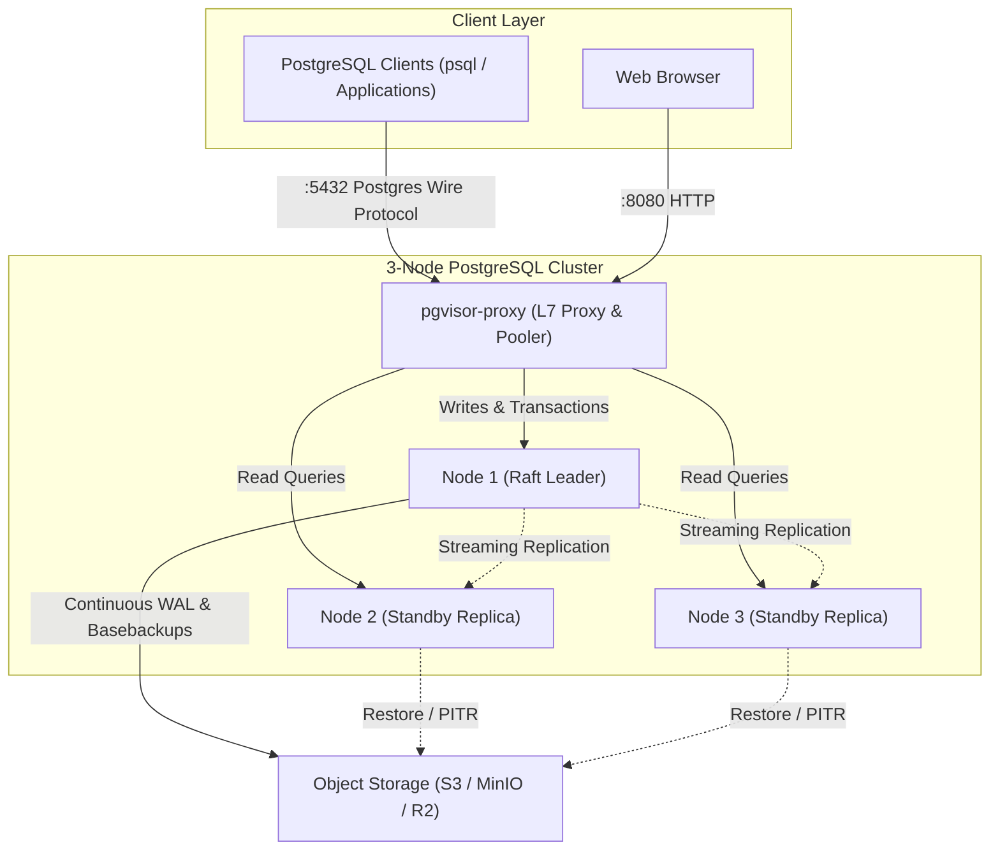
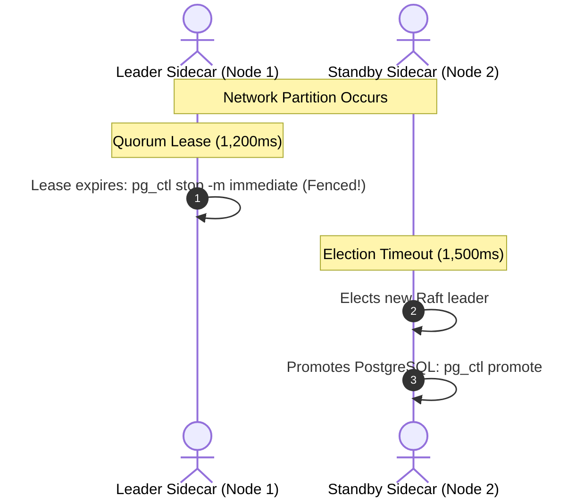

**PgVisor** replaces traditional PostgreSQL High Availability toolchains (Patroni + PgBouncer + Consul/Etcd + pgBackRest) with a unified, high-performance binary architecture implemented entirely in pure Rust.

---

## High-Level Topology

---

## Core Components

The PgVisor workspace is organized into modular Rust crates:

| Crate | Responsibility | Key Features |
| :--- | :--- | :--- |
| **`pgvisor-core`** | Domain models & common protocols | Custom pure-Rust WAL storage, OpenRaft state machine, Quorum lease, OpenDAL backup manager |
| **`pgvisor-proxy`** | L7 wire protocol proxy | Transaction-level connection pooling, read/write splitting, failover query buffering |
| **`pgvisor-sidecar`** | Container PID 1 supervisor | Subprocess reaper (`waitpid`), signal forwarding, automated `postgresql.conf`, active fencing |
| **`pgvisor-dashboard`** | Embedded web console | Real-time cluster status, node inspection, guarded read-only SQL console, audit logging |

---

## 1. L7 Connection Proxy (`pgvisor-proxy`)

The proxy intercepts and decodes PostgreSQL 3.0 wire protocol messages on port `5432`:

### Transaction-Level Connection Pooling
The proxy tracks transaction state by inspecting `ReadyForQuery ('Z')` status bytes:
- `'I'` (Idle): The backend is outside any transaction block. The backend connection is immediately released back to the idle pool.
- `'T'` (Transaction): The backend is inside an active transaction. The connection is pinned to the client until `COMMIT` or `ROLLBACK`.
- `'E'` (Error): The backend is inside an aborted transaction block. The connection remains pinned until the client issues `ROLLBACK`.

### Intelligent Read/Write Splitting
- **Write Statements**: `INSERT`, `UPDATE`, `DELETE`, `CREATE`, `DROP`, `ALTER`, `TRUNCATE`, and explicit transactions (`BEGIN`) route exclusively to the Raft leader.
- **Read Statements**: Out-of-transaction `SELECT`, `SHOW`, and `EXPLAIN` statements route to healthy standby replicas.
- **Replication Lag Awareness**: Standbys exceeding the configured replication lag threshold are temporarily removed from read routing.

### Failover Connection Buffering & Transparent Replay
If a leader crashes during client execution:
1. Idle connections to the failed leader are immediately drained.
2. In-flight requests enter an `acquire_with_retry` pause window (configurable, default 10 seconds).
3. If the backend severed the socket before transmitting response bytes (`client_bytes_written == 0`), the proxy acquires a connection to the newly promoted leader and re-executes the buffered query transparently.
4. The client's TCP socket is never dropped, eliminating application-level connection churn.

---

## 2. Sidecar Supervisor (`pgvisor-sidecar`)

The sidecar runs as **container PID 1**:

<Steps>
  <Step title="Process Supervision and Zombie Reaping">
    As PID 1, the sidecar reaps terminated zombie child processes via POSIX `waitpid` and forwards `SIGTERM`, `SIGINT`, and `SIGQUIT` signals cleanly to PostgreSQL.
  </Step>

  <Step title="Automated Configuration Generation">
    Upon startup, the sidecar dynamically generates:
    - `postgresql.conf`: Configured for WAL archiving (`archive_mode = on`, `archive_command = 'pgvisor-sidecar archive %p %f'`) and replication slots.
    - `pg_hba.conf`: Configured with replication trust and client authentication rules.
    - `standby.signal` & `primary_conninfo`: Automatically generated when bootstrapping replica nodes.
  </Step>

  <Step title="Standby Promotion & Standby Re-Sync">
    When elected leader by consensus, the sidecar executes `pg_ctl promote`. When instructed to resynchronize after a restore, it runs `pg_basebackup` against the active leader.
  </Step>
</Steps>

---

## 3. Distributed Consensus & Quorum Lease Fencing

To ensure high availability without requiring external Key-Value stores like Etcd or Consul, PgVisor embeds **OpenRaft** backed by a custom pure-Rust append-only storage engine.

### Pure-Rust Storage Engine
- **Binary Header**: Magic bytes `PGV1` (4 bytes).
- **Framed Records**: `[Payload Length: 4B][CRC32 Checksum: 4B][Binary Payload]`.
- **Sparse In-Memory Index**: `log_index -> file_offset` index initialized on boot for $O(1)$ seeks.
- **Crash Recovery**: Trailing corruption is automatically detected and safely truncated at startup.

### Split-Brain Elimination via Quorum Lease
During network partitions, traditional clusters risk "split-brain" if two nodes claim leadership simultaneously. PgVisor mathematically eliminates this with asymmetric timers:

- **Leader Quorum Lease**: **1,200 ms**. The leader must refresh its lease every 1,200 ms by receiving heartbeats from a majority of nodes.
- **Standby Election Timeout**: **1,500 ms – 3,000 ms**. Standby replicas will not initiate an election until at least 1,500 ms without leader contact.

<Aside type="danger" title="Active Self-Fencing Guarantee">
Because **1,200 ms < 1,500 ms**, an isolated leader detects lease expiration and executes immediate active self-fencing (`pg_ctl stop -m immediate`) **strictly before** any standby replica can conclude a vote and promote itself.
</Aside>

---

## 4. Continuous Cloud Backup & PITR Pipeline

PgVisor integrates **Apache OpenDAL** for unified object storage across AWS S3, MinIO, Cloudflare R2, Google Cloud Storage, and Azure Blob:

- **Continuous WAL Archiving**: PostgreSQL invokes `pgvisor-sidecar archive` on every completed 16MB WAL segment, streaming it to `clusters/<cluster_id>/wal/<segment_id>`.
- **Physical Basebackups**: Background basebackup snapshots streaming tarballs to cloud storage without locking database tables.
- **Point-In-Time-Recovery (PITR)**: Restores the closest basebackup snapshot and replays WAL segments up to an exact microsecond target.

---

## 5. Web Management Dashboard

The management dashboard runs inside `pgvisor-proxy` (port `8080`) built with Axum and Askama templates:

- **Real-Time Topology**: Node states, roles, and consensus terms.
- **Administrative Switchover**: Graceful leader step-down trigger.
- **Backup Management**: Snapshot history, on-demand backups, and PITR restore initiation.
- **Guarded SQL Console**: Read-only AST validation protecting production databases from accidental mutations.
