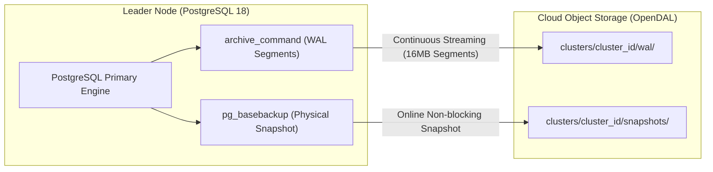

**PgVisor** provides a dual-layer backup architecture combining **continuous WAL segment streaming** with **consistent physical basebackups** to guarantee near-zero Recovery Point Objective (RPO) and fast Recovery Time Objective (RTO).

---

## How PgVisor Backups Work

PgVisor does not rely on slow and blocking logical dumps (`pg_dump`). Instead, it leverages PostgreSQL's low-level physical replication and WAL archiving engines:



---

## 1. Continuous WAL Archiving

Write-Ahead Logs (WAL) record every modification to the database before data pages are written to table storage on disk.

- **Segment Streaming**: Every completed 16MB WAL segment is shipped directly to object storage at `clusters/<cluster_id>/wal/<segment_id>`.
- **Integrity Validation**: Every segment is validated against CRC32 checksums during transmission.
- **Fail-Safe Retries**: If object storage encounters transient network connectivity drops, `archive_command` retries automatically, and PostgreSQL retains un-archived segments in `pg_wal` until upload succeeds.

---

## 2. Physical Basebackup Snapshots

While continuous WAL records changes incrementally, basebackups provide the complete baseline snapshot of the database cluster files (`PGDATA`):

<Steps>
  <Step title="Non-Blocking Stream">
    The sidecar executes `pg_basebackup` using the PostgreSQL streaming replication protocol. Unlike `pg_dump`, it never acquires exclusive table locks and does not impact read/write queries.
  </Step>

  <Step title="Direct-to-Storage Compression">
    Snapshot data is compressed (gzip) and streamed directly into object storage chunks via OpenDAL, avoiding large temporary disk usage on the database node.
  </Step>

  <Step title="Manifest Generation">
    Upon completion, a cryptographic metadata record is committed to `manifest.json`:
    - Snapshot ID and creation timestamp
    - Starting and ending Log Sequence Numbers (LSN)
    - Timeline ID
    - Archive segment boundary range
  </Step>
</Steps>

---

## Triggering Backups

Backups can be scheduled automatically or triggered on-demand.

### Automated Backups
Configured via `PGVISOR_BACKUP_FULL_HOUR_UTC` (default: daily at 01:00 UTC) and `PGVISOR_BACKUP_INCREMENTAL_INTERVAL_SECS` (default: every 3600 seconds).

### On-Demand via Web Dashboard

<Steps>
  <Step title="Open Dashboard">
    Navigate to `http://localhost:8080` in your web browser.
  </Step>

  <Step title="Navigate to Backups Tab">
    Click on the **Backups** tab in the top navigation bar.
  </Step>

  <Step title="Trigger Backup">
    Click **Take Backup Now**. The dashboard initiates the snapshot and displays live progress.
  </Step>
</Steps>

### On-Demand via HTTP Control API

You can trigger a snapshot programmatically by sending a `POST` request to the sidecar control API on the active leader:

```bash
curl -X POST http://localhost:8000/control/backup \
  -H "Authorization: Bearer postgres" \
  -H "Content-Type: application/json"
```

#### Example Response:

```json
{
  "status": "success",
  "snapshot_id": "snapshot-2026-09-18T030000Z",
  "timeline_id": 1,
  "start_lsn": "0/3000028",
  "end_lsn": "0/3000100",
  "created_at": "2026-09-18T03:00:05Z"
}
```

---

## Automated Retention & Pruning

To keep cloud storage costs controlled, PgVisor automatically evaluates the snapshot retention policy:

- **Retention Window**: Configured by `PGVISOR_BACKUP_RETENTION_DAYS` (default: 7 days).
- **Safe Pruning Algorithm**: PgVisor only deletes WAL segments that are older than the oldest retained basebackup snapshot. This guarantees that PITR remains valid across all retained snapshots without breaking recovery chains.
