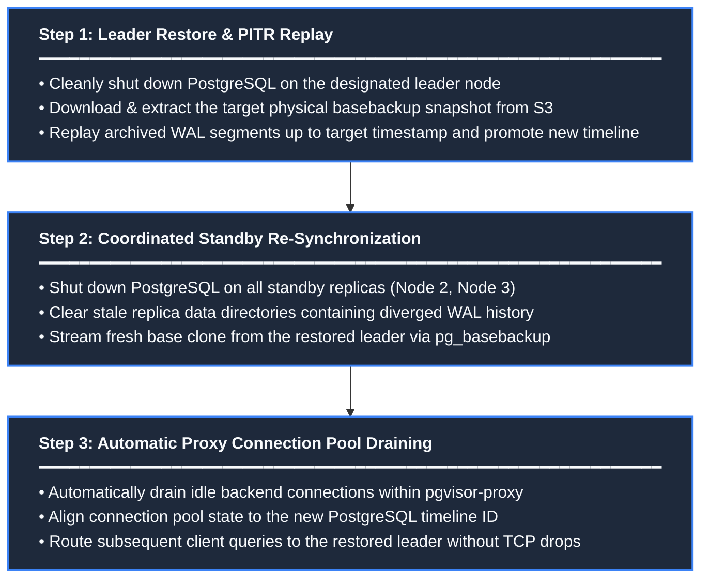

**PgVisor** supports both full basebackup snapshot restores and microsecond-precision **Point-In-Time-Recovery (PITR)**.

Restoring an entire distributed PostgreSQL cluster requires strict coordination to avoid timeline divergence and split-brain states.

---

## Recovery Modes

<CardGrid>
  <Card title="Snapshot Restore" icon="ph:database">
    Reverts the cluster to the exact state of a completed physical basebackup. Ideal when recovering from catastrophic disk corruption.
  </Card>
  <Card title="Point-In-Time-Recovery (PITR)" icon="ph:arrow-clockwise">
    Restores the closest basebackup and replays archived WAL segments up to an exact target timestamp (e.g. `2026-09-18T02:45:00Z`), recovering from accidental data deletion.
  </Card>
</CardGrid>

---

## The Standby Timeline Rewind Challenge

In PostgreSQL, restoring a past database state rewinds the Log Sequence Number (LSN) and increments the **Timeline ID** (e.g., from Timeline 1 to Timeline 2).

<Aside type="danger" title="Why Uncoordinated Restores Break Replicas">
Streaming replication standbys cannot "replicate backwards" in time. If only the leader is restored:
- Standby replicas will reject replication because their local LSN is higher than the restored leader's rewound LSN.
- Proxy queries hitting standbys would read obsolete or diverged data.
</Aside>

To solve this, PgVisor enforces a **coordinated 3-step restore workflow**:



---

## Step-by-Step Restore Walkthrough

Restores are orchestrated via the Web Dashboard, which coordinates leader restore, standby resynchronization, and proxy connection pool draining across the cluster.

### Step 1: Restore the Leader Node

Initiate the restore request via the Web Dashboard:

1. Open `http://localhost:8080` and click the **Backups** tab.
2. Under **Available Snapshots**, select your desired backup snapshot, or toggle **Point-In-Time Recovery**.
3. Enter the recovery target timestamp (e.g., `2026-09-18T02:45:00Z`).
4. Click **Start Coordinated Cluster Restore**.

During this step, the leader's sidecar:
1. Stops the local PostgreSQL process cleanly.
2. Extracts the selected basebackup tarball into `/var/lib/postgresql/data`.
3. Downloads the required WAL segments from cloud storage.
4. Generates `recovery.signal` with `recovery_target_time`.
5. Starts PostgreSQL, which replays WAL to the target point and promotes to the new timeline.

---

### Step 2: Resynchronize Standby Replicas

Once the leader finishes recovery, the supervisor automatically coordinates standby re-synchronization across all standby replicas (`pgvisor-node2`, `pgvisor-node3`) to align with the new timeline:

Each standby sidecar:
1. Stops its local PostgreSQL process.
2. Wipes the stale data directory containing diverged WAL history.
3. Clones a fresh physical copy from the restored leader via `pg_basebackup`.
4. Restarts PostgreSQL in standby mode, establishing streaming replication on the new timeline.

---

### Step 3: Automatic Proxy Connection Pool Draining

Once the leader and standby replicas finish recovery, **`pgvisor-proxy` automatically flushes its connection pool** via internal `pool.drain_all()` execution:

- **No Manual Action Required**: There is no need to manually call any API endpoint. The proxy backup orchestrator triggers `pool.drain_all().await` immediately following standby re-synchronization.
- **Why Draining is Necessary**: Restoring rewinds the LSN and increments the PostgreSQL timeline ID. Draining closes stale idle backend connections so connections are not mixed across timelines.
- **Transparent Client Reconnection**: On their subsequent transaction or query, client applications automatically acquire fresh connections to the restored leader and replicas on the new timeline without client-side connection resets.

---

## Verification

After completing the restore:

<Steps>
  <Step title="Check Cluster Status">
    Run `./setup.sh status` or inspect the dashboard at `http://localhost:8080` to verify all nodes report `Healthy` and replication lag is `0 bytes`.
  </Step>

  <Step title="Verify Database Content">
    Connect through the proxy using `psql` to verify table contents:

    ```bash
    psql -h localhost -p 5432 -U postgres -d postgres -c "SELECT * FROM users;"
    ```
  </Step>

  <Step title="Inspect Active Timeline">
    Query PostgreSQL to confirm the incremented timeline ID:

    ```bash
    psql -h localhost -p 5432 -U postgres -d postgres -c "SELECT timeline_id FROM pg_control_checkpoint();"
    ```
  </Step>
</Steps>
